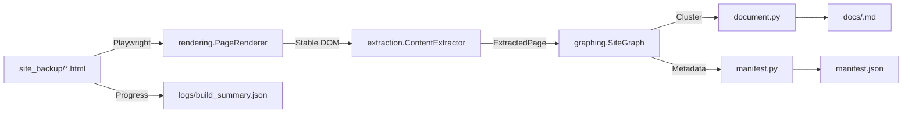

# site2docs

[](pyproject.toml)

> Rehydrate archived HTML with Playwright and emit knowledge-base-ready Markdown plus a manifest in a single command.

## Overview
site2docs ingests local HTML snapshots stored under `site_backup/`, rebuilds the DOM with Playwright, extracts readable text, analyses internal links, and ships clustered Markdown documents alongside provenance-rich metadata. It targets scenarios such as pre-RAG content curation or reviving legacy portals without rewriting their information architecture.

## Key Use Cases
- Migrate archived web docs into Markdown and a manifest before importing them into a CMS or search platform.
- Capture JavaScript-heavy FAQ/support sites as deterministic static files via automated expansion.
- Produce clean text, provenance metadata, and cluster information in one batch prior to vectorization or downstream RAG pipelines.

## Feature Highlights
- **Browser-grade rendering**: Playwright opens `file://` HTML, scrolls, expands accordions, and retries automatically. Add `--allow-render-fallback` to proceed even if rendering fails.
- **Layered extraction engine**: Attempts Readability → Trafilatura → BeautifulSoup, preserving headings and tables. Thresholds are tunable via `ExtractionConfig`.
- **Link graph clustering**: Builds a NetworkX graph and derives cluster labels/slugs from URL patterns, directory depth, and TF-IDF terms.
- **Markdown + manifest outputs**: Each cluster becomes one document with YAML front matter and citation blocks, plus a global `manifest.json` describing pages and clusters.
- **Progress visibility**: Writes NDJSON entries to `logs/build_summary.json`, so long-running batches can be tailed in another terminal in combination with `--verbose`.
- **Hallucination guardrails**: Emits `logs/hallucination_report.json`, which highlights clusters whose labels or summaries drift away from their sources.

## Architecture


## Requirements
- Python 3.11+
- [uv](https://github.com/astral-sh/uv) for dependency management and command execution
- Playwright-compatible OS (Chromium browsers can be auto-installed)

## Setup
1. Sync dependencies
   ```bash
   uv sync
   ```
2. Install browsers (first run only)
   ```bash
   uv run playwright install chromium
   ```
3. Smoke-test the CLI
   ```bash
   uv run site2docs --help
   ```

## LLM configuration (.env)
When downstream automation needs an LLM API, keep credentials in a `.env` file at the repo root.

1. Copy the template
   ```bash
   cp .env.example .env
   ```
2. Replace `SITE2DOCS_API_KEY` and `SITE2DOCS_MODEL` with your real values. `OPENAI_API_KEY` / `OPENAI_MODEL` are also recognised for compatibility.

The CLI loads `.env` automatically on startup and never overwrites variables that are already exported in the shell.

## Quickstart
Generate Markdown and a manifest from the bundled sample archive:
```bash
uv run site2docs \
  --input ./site_backup/sample_site \
  --out ./output/sample_site \
  --verbose
```
- Cluster-level Markdown appears under `output/sample_site/docs/` (e.g., `example-cluster.md`).
- `output/sample_site/manifest.json` stores page IDs, cluster IDs, URLs, and capture timestamps.
- Tail `output/sample_site/logs/build_summary.json` to observe the `discovered → rendered → extracting → clustering → completed` stages.

## CLI Options
| Option | Default | Description |
| --- | --- | --- |
| `--input` | required | Directory containing HTML files (expects the `site_backup/` structure). |
| `--out` | required | Destination for generated artifacts; creates `docs/` and `logs/` automatically. |
| `--expand-texts` | built-in list | Extra button labels (comma-separated) to force-expand accordions; merged with the default multilingual list. |
| `--render-concurrency` | auto | Overrides the auto-calculated number of concurrent Playwright pages. |
| `--allow-render-fallback` | `false` | Continue with raw HTML if rendering fails after retries. Without it, the command stops for investigation. |
| `--verbose` | `false` | Print INFO-level progress logs to stdout. |
| `--no-hallucination-check` | `false` | Skip the hallucination inspection node and omit the report. |
| `--hallucination-min-chars` | `120` | Minimum characters required per page before emitting a warning in the report. |
| `--hallucination-label-token-length` | `4` | Minimum token length that must appear in the source when validating cluster labels. |

## Output Structure
```
<out>/
  docs/
    <cluster-slug>.md     # YAML front matter + summary + TOC + body per page
  manifest.json           # Metadata for pages and clusters
  logs/
    build_summary.json    # NDJSON progress log
    hallucination_report.json # Hallucination findings per cluster
```
### Markdown Snippet
```markdown
---
doc_id: doc_001
cluster_label: Service Overview
cluster_slug: service-overview
source_urls:
  - https://example.com/service
created_at: 2025-11-07T00:00:00Z
pages:
  - pg_001
---
## Summary
...
```
### Key `manifest.json` fields
- `pages[].page_id`, `pages[].url`, `pages[].file_path`
- `pages[].cluster_id`, `clusters[].label`, `clusters[].slug`
- `created_at`: build timestamp (UTC)

## Logging & Observability
- `logs/build_summary.json` is NDJSON; each line records `stage`, counts, and the last processed file.
- `--verbose` mirrors the same milestones on stdout (render progress, extraction targets, etc.).
- For lengthy jobs, keep `tail -f output/<name>/logs/build_summary.json` open in another terminal.
- `logs/hallucination_report.json` lists inspected clusters, pages, and warnings (e.g., missing URLs or off-topic labels) for downstream auditors.

## Advanced Tips
- **Custom expand labels**: Pass `--expand-texts "Show details,表示する"` to merge bespoke strings into the default dictionary.
- **Concurrency tuning**: Limit `--render-concurrency` (e.g., `4`) on slow disks to reduce thrashing.
- **Fallback strategy**: Omit `--allow-render-fallback` when you prefer to fail fast and fix problematic HTML snapshots.
- **Log rotation**: Archive or truncate `logs/build_summary.json` after massive runs; it can grow to several MB.
- **Audit trail**: Feed `logs/hallucination_report.json` into your RAG monitoring pipeline to highlight clusters that require manual review.

## Troubleshooting
- **Playwright cannot launch**: Run `uv run playwright install chromium` and ensure required system libraries (GTK, etc.) are installed.
- **"Input directory not found"**: Point `--input` to the absolute path under `site_backup/<host>/`; avoid broken symlinks.
- **Empty extraction**: Pages under 400 characters may fall below `ExtractionConfig.min_content_characters`; skip template/redirect shells.
- **Fragmented clusters**: Reduce URL depth or rebuild internal links if shallow directories create too many singletons.

## Developer Notes
- Source lives under `src/site2docs/` with modules for rendering, extraction, graphing, document assembly, manifest writing, the builder, and CLI glue.
- Tests: `uv run pytest`
- CLI help: `uv run site2docs --help`
- Manage dependencies exclusively through `pyproject.toml` / `uv.lock` with uv.

## Versioning
- Current release: **v0.1.0** (mirrors the `version` field in `pyproject.toml`).
- When tagging releases, ensure this badge and `pyproject.toml` stay in sync.

## Related Documents
- `codex_spec_static_doc_generation.md`: background specification and desired outputs
- `AGENTS.md`: repo-wide guidelines

## License
Distributed under the MIT License. See `LICENSE` for details.
