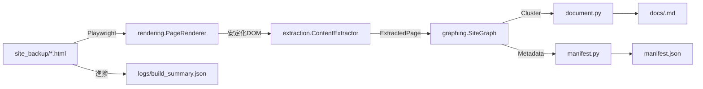

# site2docs

[](pyproject.toml)

> アーカイブ済み HTML を Playwright で再現し、知識ベースに最適化された Markdown と manifest をワンコマンドで生成するツールキット。

英語版 README は [README.en.md](README.en.md) を参照してください。

## 概要
site2docs は、`site_backup/` に保存されたローカル HTML 群を解析し、リンク構造・本文・取得日時を再整理した静的ナレッジベースを構築します。RAG 導入前の資料整備や、保守が止まった社内ポータルの再編など「情報を壊さずに読みやすく整理したい」シーンを想定しています。

## 主なユースケース
- 社内外ドキュメントのアーカイブを Markdown & manifest へ移行し、検索基盤や CMS へ安全に取り込む。
- Playwright による自動展開で、JS 依存の FAQ / サポートサイトを静的ファイル化する。
- RAG 前処理として「クリーンなテキスト」「由来メタデータ」「クラスタ情報」をまとめて生成する。

## 機能ハイライト
- **ブラウザレンダリング**: Playwright が `file://` HTML を開き、スクロール・折りたたみ解除・再試行を自動化。失敗時は安全にフォールバックし、必要に応じて `--allow-render-fallback` で処理継続。
- **多段抽出エンジン**: Readability → Trafilatura → BeautifulSoup の順に本文抽出を試行し、見出しや表を保持。最低文字数やセマンティック領域の閾値は `ExtractionConfig` で管理。
- **リンクグラフ・クラスタリング**: NetworkX でサイトグラフを構築し、URL パターン・ディレクトリ深度・TF-IDF に基づいてクラスタラベル/スラッグを自動生成。
- **Markdown + manifest**: 各クラスタを 1 ドキュメントに統合し、YAML フロントマターと出典情報を付与。`manifest.json` にはページ/クラスタ単位のメタデータを保持。
- **進捗可視化**: `logs/build_summary.json` にステージごとの NDJSON ログを書き込み、`--verbose` と合わせて長時間バッチを追跡可能。

## アーキテクチャ概要


## 動作要件
- Python 3.11 以上
- [uv](https://github.com/astral-sh/uv)（依存同期・コマンド実行に使用）
- Playwright が動作する OS（Chromium ベースブラウザを自動インストール可能）

## セットアップ
1. 依存関係を同期
   ```bash
   uv sync
   ```
2. Playwright 用ブラウザを初期化（初回のみ）
   ```bash
   uv run playwright install chromium
   ```
3. 動作確認
   ```bash
   uv run site2docs --help
   ```

## クイックスタート
最小構成で Markdown と manifest を生成する例です。
```bash
uv run site2docs \
  --input ./site_backup/sample_site \
  --out ./output/sample_site \
  --verbose
```
- `output/sample_site/docs/*.md` にクラスタ単位のドキュメントが作成されます（例: `output/sample_site/docs/example-cluster.md`）。
- `output/sample_site/manifest.json` にはページ ID、クラスタ ID、URL、取得時刻が格納されます。
- `output/sample_site/logs/build_summary.json` を `tail -f` すると、`discovered → rendered → extracting → clustering → completed` の進捗が確認できます。

## CLI オプション一覧
| オプション | 既定値 | 説明 |
| --- | --- | --- |
| `--input` | (必須) | HTML を含むディレクトリ。`site_backup/` 以下の階層構造を前提。 |
| `--out` | (必須) | 生成物の出力先。既存ファイルは再利用し、`docs/` `logs/` を自動作成。 |
| `--expand-texts` | 内蔵辞書 | 折りたたみ解除に使うボタン文言をカンマ区切りで追加。既定リストとマージされます。 |
| `--render-concurrency` | 自動推定 | Playwright 同時ページ数。CPU コア数と入力件数からの推定値を上書きする際に指定。 |
| `--allow-render-fallback` | `false` | レンダリング再試行後も失敗したページをローカル HTML のまま処理して継続。指定しない場合は例外で停止。 |
| `--verbose` | `false` | INFO ログを標準出力へ出し、進捗をリアルタイムに確認。 |

## 出力構成
```
<out>/
  docs/
    <cluster-slug>.md     # YAMLフロントマター + 概要 + 目次 + ページ本文
  manifest.json           # pages/clusters のメタデータ
  logs/
    build_summary.json    # NDJSON 形式の進捗ログ
```
### Markdown の例 (抜粋)
```markdown
---
doc_id: doc_001
cluster_label: サービス紹介
cluster_slug: service-overview
source_urls:
  - https://example.com/service
created_at: 2025-11-07T00:00:00Z
pages:
  - pg_001
---
## サマリー
...
```
### manifest.json の主なフィールド
- `pages[].page_id` / `pages[].url` / `pages[].file_path`
- `pages[].cluster_id` / `clusters[].label` / `clusters[].slug`
- `created_at`: ビルド時刻（UTC）

## ログと可観測性
- `logs/build_summary.json` は 1 行 1 JSON の NDJSON。`stage` フィールドで現在の工程を確認できます。
- `--verbose` を付けると INFO ログが CLI にも出力され、Playwright の進行状況や抽出対象ファイル名が分かります。
- 長時間ジョブでは `tail -f output/<name>/logs/build_summary.json` を別ターミナルで常時監視する運用を推奨します。

## 高度な設定・運用 Tips
- **独自ボタンの展開**: `--expand-texts "表示する,Show details"` のように追加すると既定辞書へ自動マージされます。
- **並列度の調整**: I/O が遅いファイルシステムでは `--render-concurrency 4` など控えめに設定すると安定します。
- **フォールバック戦略**: 品質を最優先する場合は `--allow-render-fallback` を付けずに失敗ページを洗い出し、HTML 側を修正して再実行してください。
- **ログローテーション**: 大規模サイトでは `logs/build_summary.json` が数 MB になる場合があります。完了後にアーカイブまたは削除してディスクを管理してください。

## トラブルシューティング
- **Playwright がブラウザを起動できない**: `uv run playwright install chromium` を実行し、必要な依存パッケージ（libgtk など）が OS に入っているか確認してください。
- **入力ディレクトリが見つからないエラー**: `site_backup/<host>/` の絶対パスを指定し、シンボリックリンクの場合は実体パスを渡してください。
- **抽出結果が空になる**: HTML が 400 文字以下の場合は `ExtractionConfig.min_content_characters` に達しない可能性があります。テンプレートやメタリフレッシュのみのページは除外してください。
- **クラスタが分裂しすぎる**: ルート直下に多数のサブディレクトリがある場合、URL パターン深度を下げるか、リンクを再構築して再アーカイブしてください。

## 開発者向けメモ
- コードは `src/site2docs/` に集約。責務別モジュール（`rendering.py` / `extraction.py` / `graphing.py` / `document.py` / `manifest.py` / `builder.py` / `cli.py`）。
- テスト: `uv run pytest`
- CLI ヘルプ確認: `uv run site2docs --help`
- 依存管理: すべて uv 経由で行い、`pyproject.toml`/`uv.lock` を唯一のソースオブトゥルースとしてください。

## バージョン
- 現行バージョン: **v0.1.0** （`pyproject.toml` の `version` フィールドに追従）
- リリースタグを作成する際は `pyproject.toml` と README のバッジが一致していることを確認してください。

## 関連ドキュメント
- `codex_spec_static_doc_generation.md`: 仕様の背景と期待する出力構成
- `AGENTS.md`: リポジトリ横断のルールセット

## ライセンス
本プロジェクトは MIT License の下で配布されます。詳細はリポジトリ直下の `LICENSE` を参照してください。
